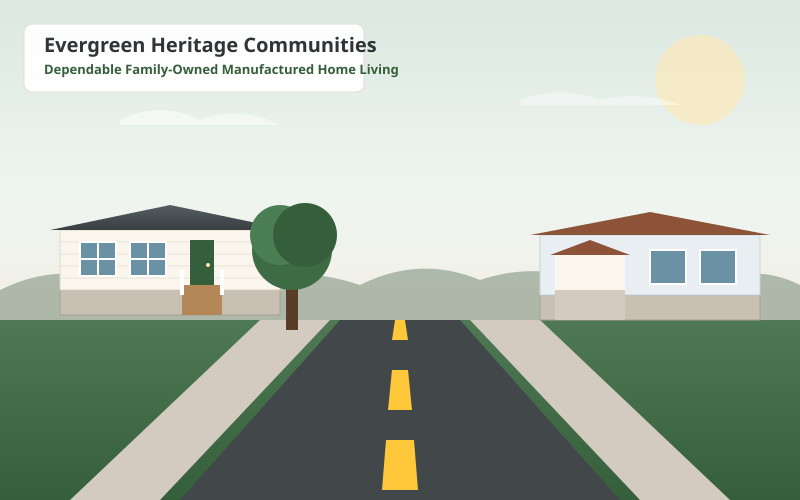

# Evergreen Heritage Communities

> Modern, responsive, and trustworthy website for a family-owned business operating multiple manufactured home communities and trailer parks across Texas (est. 1989).



---

## Overview

Designed to communicate warmth, dependability, and stability rather than corporate luxury. Built mobile-first with high accessibility (WCAG 2.2 AA), fast load times, and a dual-mode setup (runs as a Node.js Express app with file uploads and security headers, or as a purely static site on CDNs).

### Featured Communities
1. **Oak Ridge Estates** — Round Rock, TX (Austin Metro Area)
2. **Pine Valley Living** — Tyler, TX (East Texas Piney Woods)
3. **Cedar Grove Community** — New Braunfels, TX (Hill Country / San Antonio North)
4. **Willow Creek Village** — Denton, TX (North Dallas / DFW Metro)

---

## Features

- **Mobile-First UX**: Fixed bottom action bar (`Call`, `Availability`, `Directions`, `Contact`) for single-thumb navigation, plus an accessible slide-out mobile drawer.
- **Brand Palette**: Forest Green (`#355E3B`), Warm Beige (`#F3EFE6`), Charcoal (`#2F3437`), Soft Gray (`#F7F7F5`), and Warm Accent Orange (`#C9783A`).
- **Interactive Map**: Built with Leaflet & OpenStreetMap (no API key required, zero risk of leaked keys) with custom pins and turn-by-turn Google Maps direction links.
- **Available Inventory**: Real-time filtering for homes for sale, rentals, and vacant lots with an automatic **Priority Waiting List** fallback.
- **Community Detail Pages**: Transparent pricing tables, rules snapshots, amenities grids, and photo galleries with lightbox modals.
- **Current Residents Hub**: Easy access to online rent payment, community announcements, and downloadable resident forms (pet agreements, ACH auto-pay).
- **Maintenance Request Portal**: Critical life-safety emergency notice + secure form with file upload dropzone for photo attachments.
- **Categorized FAQ**: 11 categories with instant real-time live search.
- **Security**: Express server with Helmet security headers, rate limiting, Multer file upload validation (5MB max, MIME checks), and silent honeypot spam protection.
- **Local SEO Ready**: JSON-LD `LocalBusiness` and `Organization` schema, OpenGraph tags, semantic HTML5, `sitemap.xml`, and `robots.txt`.

---

## Tech Stack

- **Frontend**: HTML5, Modern CSS (Design tokens, Grid, Flexbox, Container queries), Vanilla ES6+ JavaScript, Leaflet.js
- **Backend**: Node.js, Express.js
- **Security & Utilities**: Helmet, Express Rate Limit, Multer, CORS

---

## Getting Started

### Prerequisites
- Node.js (v18 or newer recommended)
- npm

### Installation

```bash
# Clone the repository
git clone https://github.com/<username>/<repo-name>.git

# Navigate to the project directory
cd trailer-park-website

# Install dependencies
npm install

# Start the local server
npm start
```

Open your browser to `http://localhost:3000`.

---

## Project Structure

```
trailer-park-website/
├── data/
│   ├── communities.json       # Structured data for communities
│   └── listings.json          # Structured data for available homes & lots
├── public/
│   ├── css/
│   │   ├── variables.css      # Design tokens (palette, spacing, typography)
│   │   ├── main.css           # Base styles, header, footer, navigation
│   │   ├── components.css     # Badges, cards, modals, filters, accordions
│   │   └── pages.css          # Hero, pricing tables, rules, emergency banners
│   ├── js/
│   │   ├── app.js             # Global navigation, active states, modals, lightbox
│   │   ├── data.js            # API data loader with offline fallback
│   │   ├── communities.js     # Communities filtering & directory logic
│   │   ├── community-detail.js# Property details, pricing, gallery, rules
│   │   ├── availability.js    # Search & filters for homes/lots
│   │   ├── listing-detail.js  # Single listing view & tour scheduler
│   │   ├── map.js             # Leaflet interactive map initializer
│   │   ├── forms.js           # Validation, honeypot & AJAX submissions
│   │   └── faq.js             # FAQ categorization & live search
│   ├── images/                # Vector SVG illustrations & logo
│   ├── uploads/               # Secure directory for maintenance photos
│   ├── index.html             # Homepage (all 8 sections)
│   ├── communities.html       # Communities directory
│   ├── community.html         # Individual community template
│   ├── availability.html      # Searchable available homes & lots
│   ├── listing-detail.html    # Listing details template
│   ├── residents.html         # Current residents resource hub
│   ├── maintenance.html       # Resident maintenance request portal
│   ├── faq.html               # 11-category FAQ with live search
│   ├── about.html             # Family business history & values
│   ├── contact.html           # Office contacts & inquiry form
│   ├── privacy.html           # Privacy policy
│   ├── terms.html             # Terms & Fair Housing statement
│   ├── 404.html               # Custom 404 error page
│   ├── sitemap.xml            # SEO sitemap
│   └── robots.txt             # Search crawler directives
├── server.js                  # Express backend & API
├── package.json
└── README.md
```

---

## License

ISC License • &copy; 1989–2026 Evergreen Heritage Communities. Equal Housing Opportunity.
